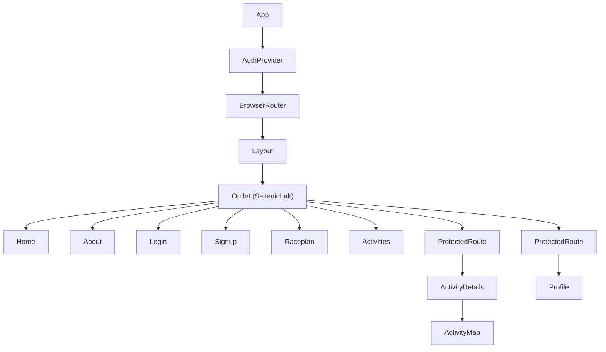

# Architekturdiagramme – 210_public_cloud

Mermaid-Diagramme zur Systemarchitektur (vgl. `documentation.md`, Abschnitt 3.3).

---

## Abbildung 3.1 – Komponentendiagramm (Frontend, Supabase, externe Dienste)

```mermaid
flowchart TB
    subgraph Client["Browser (Benutzer)"]
        User["Gast / User / Admin"]
    end

    subgraph Frontend["React SPA (webpage-jabra)"]
        direction TB

        subgraph Core["Kern & Routing"]
            Main["main.jsx"]
            App["App.jsx"]
            Router["React Router"]
            AuthCtx["AuthContext"]
            Layout["Layout.jsx<br/>(Header, Nav, Footer)"]
            Protected["ProtectedRoute"]
        end

        subgraph Pages["Seiten-Komponenten"]
            Home["Home"]
            About["About"]
            Login["Login"]
            Signup["Signup"]
            Raceplan["Raceplan"]
            Activities["Activities"]
            ActivityDetails["ActivityDetails"]
            Profile["Profile"]
        end

        subgraph SubComponents["Unterkomponenten"]
            ActivityMap["ActivityMap<br/>(Leaflet)"]
        end

        subgraph Utils["Utils & Config"]
            SupaClient["supabase-client.js"]
            AthleteCfg["config/athlete.js"]
            ActUtils["utils/activities.js"]
            DetailUtils["utils/activityDetails.js"]
            RaceUtils["utils/raceplan.js"]
            DateUtils["utils/dateFormat.js"]
            MapUtils["utils/map.js"]
        end

        Main --> App
        App --> AuthCtx
        App --> Router
        Router --> Layout
        Layout --> Pages
        Router --> Protected
        Protected --> ActivityDetails
        Protected --> Profile

        ActivityDetails --> ActivityMap
        ActivityMap --> MapUtils

        Home --> AthleteCfg
        About --> AthleteCfg
        About --> SupaClient
        ActivityDetails --> AthleteCfg
        ActivityDetails --> DetailUtils
        ActivityDetails --> DateUtils
        Activities --> ActUtils
        Activities --> DateUtils
        Raceplan --> RaceUtils
        Raceplan --> DateUtils

        AuthCtx --> SupaClient
        Layout --> AuthCtx
        Layout --> SupaClient
        Login --> SupaClient
        Signup --> SupaClient
        Profile --> AuthCtx
        Profile --> SupaClient
        Activities --> AuthCtx
        Activities --> SupaClient
        Raceplan --> AuthCtx
        Raceplan --> SupaClient
        ActivityDetails --> SupaClient
        Protected --> AuthCtx
    end

    subgraph Supabase["Supabase Cloud"]
        direction TB

        subgraph Auth["Auth"]
            SupaAuth["E-Mail / Passwort<br/>JWT Session"]
        end

        subgraph DB["PostgreSQL + RLS"]
            Profiles["profiles"]
            Races["races"]
            StravaAct["strava_activities"]
            StravaView["strava_activities_overview<br/>(View)"]
            StravaConn["strava_connection"]
            Trigger["Trigger: handle_new_user"]
        end

        subgraph Edge["Edge Functions"]
            SyncFn["sync-strava-activities"]
        end

        subgraph Storage["Storage"]
            Images["Bucket: images"]
        end
    end

    subgraph External["Externe Dienste"]
        Strava["Strava REST API"]
        OSM["OpenStreetMap Tiles"]
    end

    User --> Frontend

    SupaClient --> SupaAuth
    SupaClient --> DB
    SupaClient --> Storage
    Activities -->|"Admin: Sync-Button"| SyncFn

    SupaAuth --> Profiles
    Trigger --> Profiles
    SyncFn --> StravaConn
    SyncFn --> Strava
    SyncFn --> StravaAct

    Activities --> StravaView
    ActivityDetails --> StravaAct
    Raceplan --> Races
    Profile --> Profiles
    About --> Images
    ActivityMap --> OSM
```

---

## Abbildung 3.2 – React-Komponentenhierarchie

